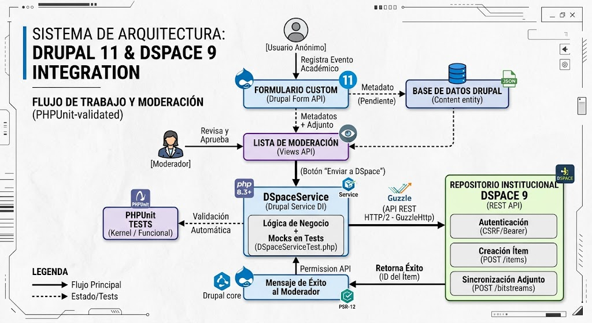
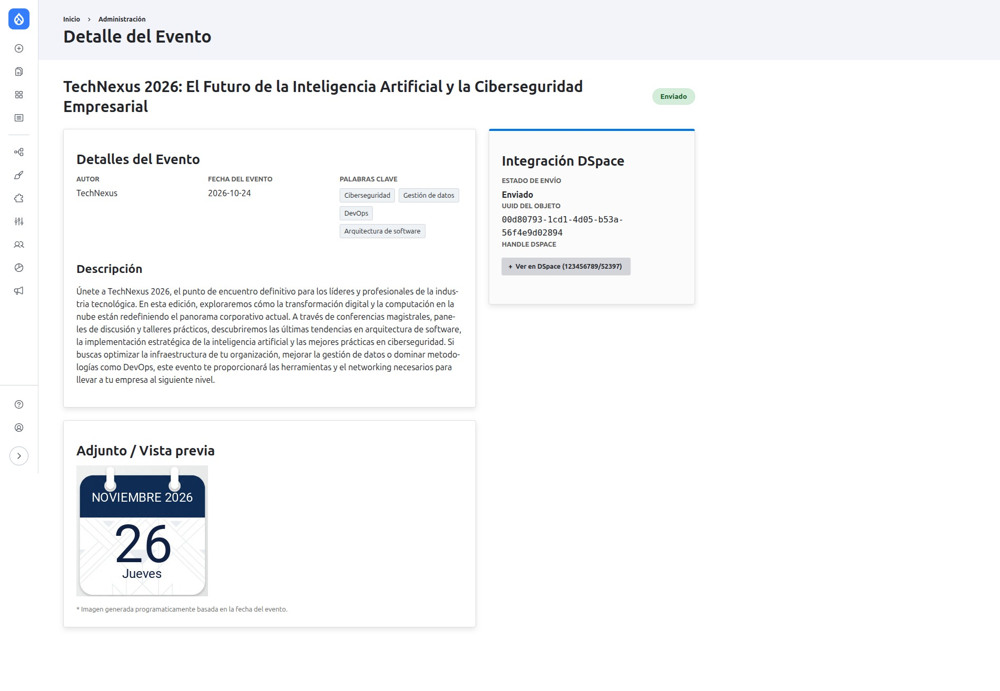
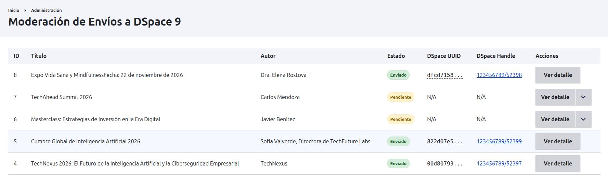
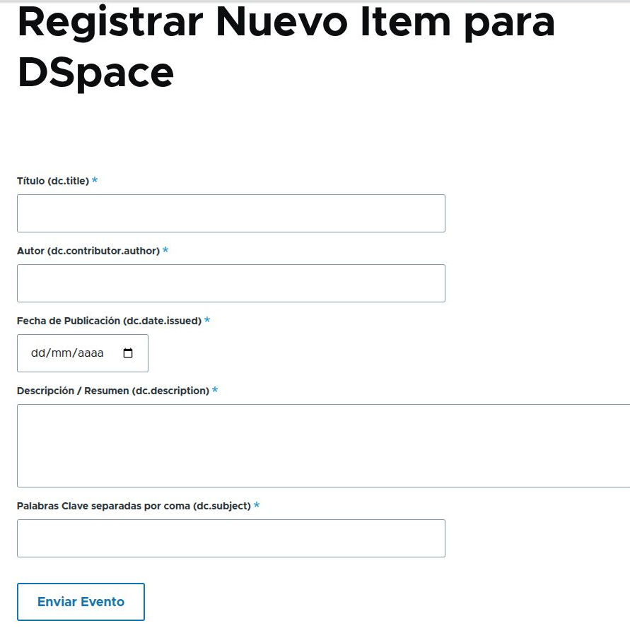
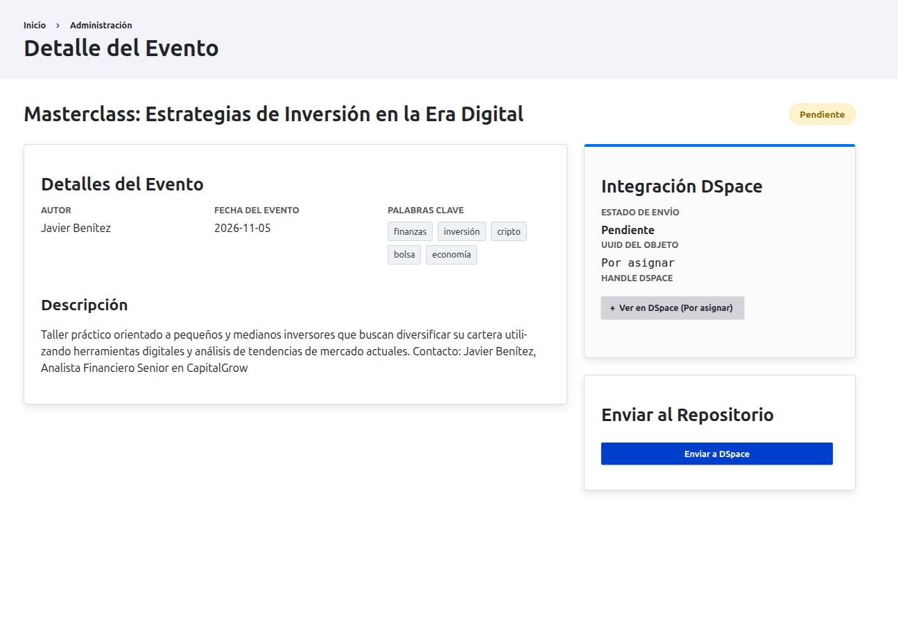

[](https://github.com/Diego-Uzc-J/Integracion-Drupal-DSpace-por-API-Rest/actions)


# 🏛️ Ingresar Evento — Drupal 11 & DSpace 9 Integration Module

[](https://www.drupal.org)
[](https://dspace.lyrasis.org)
[](https://phpunit.de)
[](https://www.php.net)

Módulo personalizado para **Drupal 11** diseñado para facilitar el registro público y anonimizado de eventos académicos relacionados con la institución, incorporando un flujo de trabajo con moderación editorial y sincronización de ítems y adjuntos hacia un repositorio institucional **DSpace 9** mediante su API REST.

---

## 📐 Arquitectura del Sistema





El módulo sigue una arquitectura limpia orientada a servicios, desacoplando completamente la lógica de negocio, la capa de presentación y las comunicaciones HTTP de terceros mediante Inyección de Dependencias (*Dependency Injection*).

* **Formulario Anónimo:** Captura y valida metadatos académicos (`titulo`, `autor`, `fecha`, `descripcion`, `palabras_clave`).
* **Flujo de Moderación:** Control de acceso basado en permisos (`Permission API`) para que un rol administrativo/moderador gestione los registros pendientes. Para los eventos aprobados, el sistema genera un thumbnail con la fecha del evento, que será asignado como bitstream del item en DSpace. Este usuario moderador inicia el proceso de 'Enviar a DSpace' los datos del evento.
* **Servicio DSpace (`DSpaceConnectorService`):** Maneja la autenticación por token (CSRF/Bearer) y las peticiones `POST` multipart/json para enviar entidades y archivos binarios a DSpace 9.

---

## ⚙️ Flujo de Metadatos (Drupal 11 ➡️ DSpace 9)

El módulo realiza un mapeo estructurado desde los campos capturados en el formulario hacia los campos Dublin Core (`dc`) aceptados por DSpace 9:


| Campo Formulario | Metadato Dublin Core | Descripción |
| :--- | :--- | :--- |
| `titulo` | `dc.title` | Título principal del evento |
| `autor` | `dc.contrib.author` | Autor o entidad organizadora |
| `fecha` | `dc.date.issued` | Fecha de realización del evento |
| `descripcion` | `dc.description.abstract` | Resumen o descripción detallada |
| `palabras_clave` | `dc.subject` | Listado de términos/etiquetas de búsqueda |
| Thumbnail dinámico | Bitstream Attachment | Adjunto gráfico subido al bundle `ORIGINAL` |


> **Nota de Configuración:** Dependiendo de la configuración de los archivos del flujo de envíos en DSpace (`input-forms.xml` y `item-submission.xml`), es posible que tu instancia requiera el envío de campos adicionales en Drupal (específicamente aquellos configurados como obligatorios en el repositorio).

---

## 📂 Estructura del Módulo

```text
ingresar_evento/
├── capturas/                         # Evidencia visual para documentación
│   ├── 00_arquitectura_drupal11_dspace9.jpeg
│   ├── 01_detalleEventoEnviado.jpg
│   ├── 02_listado_eventos.jpg
│   ├── 03_nuevo_evento.jpg
│   └── 04_EventoPendiente.jpg
├── css/                              # Estilos aislados por componente
│   ├── ingresar-evento-detalle.css  # Estilos para la ficha detallada del evento
│   └── moderacion-list.css          # Estilos para la tabla e interfaz de moderación
├── fonts/                            # Tipografías para renderizado gráfico
│   ├── Roboto-Medium.ttf
│   └── Roboto-Regular.ttf
├── img/                              # Recursos gráficos estáticos
│   └── calendario-evento-instituto.jpg # Plantilla base para thumbnails
├── src/
│   ├── Controller/                   # Controladores HTTP
│   │   ├── EventoDetalleController.php # Renderizado de la vista de detalle
│   │   └── ModeracionController.php    # Panel de control editorial y acción de envío REST. Cliente HTTP REST para DSpace 9 (Auth + Items + Bitstreams)
│   ├── Form/                         # Formularios API Drupal
│   │   └── IngresarEventoForm.php    # Captura y validación de metadatos anónimos
│   └── Services/                     # Capa de Servicios y Lógica de Negocio
│       ├── DSpaceConnectorService.php  # Cliente HTTP REST para DSpace 9 (Auth + Items + Bitstreams)
│       └── EventImageGenerator.php   # Generador dinámico de imágenes/thumbnails
├── templates/                        # Plantillas Twig personalizadas
│   └── ingresar-evento-detalle.html.twig   # Plantilla para la pagina de evento de detalle
├── ingresar_evento.info.yml          # Metadatos del módulo para Drupal 11
├── ingresar_evento.libraries.yml     # Definición de assets CSS/JS
├── ingresar_evento.module            # Hooks principales del módulo
├── ingresar_evento.routing.yml       # Definición de rutas y permisos
├── ingresar_evento.services.yml      # Declaración de servicios e Inyección de Dependencias
└── README.md                         # Documentación del repositorio
```

---


## 🧪 Pruebas y Calidad de Código

Este módulo incluye una completa suite de pruebas automatizadas con PHPUnit para garantizar la estabilidad de la integración con la API REST de DSpace 9, el manejo del formulario personalizado para usuarios anónimos y el flujo de moderación.

### 1. Pruebas Kernel (`DSpaceServiceTest.php`)
Validan la lógica de negocio a nivel de servicio y la persistencia en base de datos sin necesidad de levantar un navegador completo.

* **Ubicación:** `tests/src/Kernel/DSpaceServiceTest.php`
* **Qué prueban:**
  * **Integración con la API**: Simulación de respuestas HTTP de DSpace mediante ClientInterface para asegurar que el servicio procesa correctamente la creación de ítems.   
  * **Persistencia local**: Verificación del correcto funcionamiento del esquema de base de datos (ingresar_evento_registros) definido en el archivo .install, comprobando el almacenamiento de los campos del evento (título, autor, fecha, descripción, palabras_clave, estado y metadatos de DSpace).   

### 2. Pruebas Funcionales (`DspaceIntegrationTest.php`)
Evalúan el comportamiento end-to-end desde la perspectiva del usuario y del moderador dentro de Drupal 11.

* **Ubicación:** `tests/src/Functional/DspaceIntegrationTest.php`
* **Qué prueban:**
  * **Flujo de Usuario Anónimo**: Envío exitoso del formulario público con los campos requeridos y validación del mensaje de confirmación.
  * **Control de Accesos**: Comprobación de que un usuario anónimo no tiene permisos para ver o ejecutar el botón de envío a DSpace.
  * **Flujo del Moderador**: Autenticación de un usuario con permisos de moderación y simulación mediante HandlerStack y MockHandler de Guzzle de la secuencia completa de la API REST de DSpace 9 (Handshake CSRF, Autenticación JWT, creación de Workspace Item, inyección de metadatos, subida de adjuntos multipart y envío al workflow final).

---

### 🚀 Cómo ejecutar las pruebas

Si tienes configurado tu entorno de desarrollo local con Composer y PHPUnit, puedes ejecutar las pruebas de la siguiente manera:

```bash
# Ejecutar la prueba Kernel
vendor/bin/phpunit -c core/phpunit.xml.dist modules/custom/ingresar_evento/tests/src/Kernel/DSpaceServiceTest.php

# Ejecutar la prueba Funcional
vendor/bin/phpunit -c core/phpunit.xml.dist modules/custom/ingresar_evento/tests/src/Functional/DspaceIntegrationTest.php
```

---

## 🛠️ Tecnologías y Estándares

* **Framework:** Drupal 11.x
* **Plataforma Objetivo:** DSpace 9 REST API
* **Estándar de Código:** PSR-12 / Drupal Coding Standards (`phpcs`)
* **Testing:** PHPUnit, Drupal KernelTestBase, Drupal BrowserTestBase

---

## ⚙️ Requisitos e Instalación
### Requisitos Previos

* Sitio en Drupal 11 en ejecución.
* Servidor DSpace 9 con la API REST habilitada y credenciales con permisos de escritura en la colección destino.
* PHP 8.3 o superior con la librería GD o Imagick habilitada (para la generación de miniaturas).

### Instalación
Clona o descarga este repositorio dentro de la carpeta de módulos personalizados de tu instalación de Drupal:

```Bash
cd web/modules/custom/ingresar_evento/
git clone https://github.com/Diego-Uzc-J/Integracion-Drupal-DSpace-por-API-Rest.git
```

Habilita el módulo mediante Drush o la interfaz de administración:

```Bash
drush en ingresar_evento -y
```

Configura las credenciales de conexión y endpoints de DSpace en el archivo de configuración de Drupal (settings.php):

```PHP
$settings['dspace_api_base_url'] = 'https://tu-repositorio-dspace.edu/server/api';
$settings['dspace_api_user'] = 'admin@institucion.edu';
$settings['dspace_api_password'] = 'tu_password';
$settings['dspace_api_collection'] = 'ae4f941b-5317-1344-8039-12ba7abd46e0';
```
---

## 📸 Vista Previa del Módulo en Funcionamiento

A continuación se muestran algunas de las visualizaciones del módulo:
<br/>
<table>
  <tr>
    <td colspan="2">
        <b>Detalles de Evento enviado</b>
        
    </td>
  </tr>
  <tr>
    <td colspan="2">
        <b>Panel de moderación de Eventos</b>
        
    </td>
  </tr>
  <tr>
    <td>
        <b>Formulario de nuevo evento</b>
        
    </td>
    <td>
        <b>Los evento recien enviado quedan en estado 'Pendiente', esperando revisión de moderador.</b>
        
    </td>
  </tr>
</table>

---
*Creado por Ing. Diego A. Uzcátegui J. | www.linkedin.com/in/diego-uzc-j | Portafolio Profesional*


